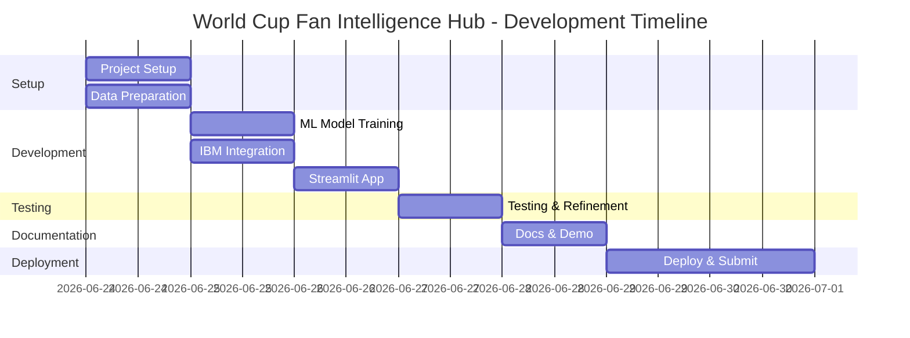

seconds
- Model inference: <1 second
- Chart rendering: <1 second
- API response: <2 seconds

**Testing Checklist:**
- [ ] All pages load correctly
- [ ] Predictions generate successfully
- [ ] Charts display properly
- [ ] IBM Granite explanations appear
- [ ] Mobile view works
- [ ] No console errors
- [ ] Data loads from cache
- [ ] Error handling works

---

### 8.3 3-Minute Demo Video

**Platform:** YouTube (unlisted or public)

**Video Specifications:**
- Duration: Exactly 3 minutes (±5 seconds)
- Resolution: 1080p (1920x1080)
- Format: MP4
- Audio: Clear narration
- Captions: Optional but recommended

**Content Structure:**

**Segment 1: Introduction (0:00-0:30)**
- Hook: "What if every football fan could predict World Cup matches like a pro?"
- Problem statement
- Solution overview
- Your name and project name

**Segment 2: Live Demo (0:30-2:00)**
- Match Predictor (45 seconds)
  - Select teams
  - Show prediction
  - Highlight AI explanation
- Team Statistics (30 seconds)
  - Display dashboard
  - Show trends
- Head-to-Head (45 seconds)
  - Compare rivals
  - Show history

**Segment 3: Technical & Impact (2:00-2:45)**
- IBM Granite integration (15 seconds)
- RandomForest model (15 seconds)
- Dataset scope (15 seconds)
- Who benefits (15 seconds)

**Segment 4: Closing (2:45-3:00)**
- Future enhancements
- Call to action
- Thank you

**Production Tips:**
- Use screen recording software (OBS, Loom)
- Script your narration
- Practice 2-3 times before recording
- Add background music (low volume)
- Include title cards
- Show your face (optional but engaging)

---

### 8.4 README Documentation

**Required Sections:**

1. **The Problem** (200-300 words)
   - Current state of football analytics
   - Barriers to access
   - User pain points
   - Market gap

2. **Our Approach** (300-400 words)
   - Technical solution overview
   - IBM technologies used
   - ML model explanation
   - Data pipeline
   - User experience design

3. **Why It Matters** (200-300 words)
   - Democratizing analytics
   - Educational value
   - Fan engagement
   - Broader impact on sports tech

**Additional Required Elements:**
- Installation instructions
- Usage guide
- Screenshots
- Demo links
- License information
- Contact details

---

## 9. Timeline & Milestones

### Overview
**Total Duration:** 6 days (June 24-30, 2026)  
**Submission Deadline:** June 30, 2026, 11:59 PM

### Daily Breakdown

#### Day 1: June 24, 2026 (Tuesday)
**Focus:** Setup & Data Preparation  
**Hours:** 6-8 hours

**Morning (3-4 hours):**
- ✅ Initialize Git repository
- ✅ Create project structure
- ✅ Set up Python environment
- ✅ Configure IBM watsonx.ai
- ✅ Download dataset

**Afternoon (3-4 hours):**
- ✅ Data exploration
- ✅ Data cleaning
- ✅ Initial feature engineering
- ✅ Create training dataset

**Deliverables:**
- Project structure complete
- Clean dataset ready
- Features engineered

---

#### Day 2: June 25, 2026 (Wednesday)
**Focus:** ML Model & IBM Integration  
**Hours:** 7-8 hours

**Morning (3-4 hours):**
- ✅ Train RandomForest model
- ✅ Hyperparameter tuning
- ✅ Model evaluation
- ✅ Save trained model

**Afternoon (4 hours):**
- ✅ IBM Granite setup
- ✅ Explanation generation
- ✅ Prompt engineering
- ✅ Integration testing

**Deliverables:**
- Trained ML model (>65% accuracy)
- IBM Granite integration working
- Prediction engine complete

---

#### Day 3: June 26, 2026 (Thursday)
**Focus:** Streamlit Application  
**Hours:** 8 hours

**Morning (4 hours):**
- ✅ Main app structure
- ✅ Match Predictor page
- ✅ Prediction display components

**Afternoon (4 hours):**
- ✅ Team Statistics page
- ✅ Head-to-Head page
- ✅ Charts and visualizations

**Deliverables:**
- Working Streamlit app
- All 3 pages functional
- UI polished

---

#### Day 4: June 27, 2026 (Friday)
**Focus:** Testing & Refinement  
**Hours:** 6-7 hours

**Morning (3 hours):**
- ✅ Unit testing
- ✅ Integration testing
- ✅ Bug fixes

**Afternoon (3-4 hours):**
- ✅ Performance optimization
- ✅ UI/UX improvements
- ✅ Error handling
- ✅ Mobile responsiveness

**Deliverables:**
- All tests passing
- Bugs fixed
- Optimized performance

---

#### Day 5: June 28, 2026 (Saturday)
**Focus:** Documentation & Demo  
**Hours:** 6-7 hours

**Morning (3-4 hours):**
- ✅ Write comprehensive README
- ✅ Create technical documentation
- ✅ Add code comments

**Afternoon (3 hours):**
- ✅ Record demo video
- ✅ Edit video
- ✅ Upload to YouTube

**Deliverables:**
- Complete README
- 3-minute demo video
- Documentation finished

---

#### Day 6: June 29-30, 2026 (Sunday-Monday)
**Focus:** Deployment & Submission  
**Hours:** 4-5 hours

**Tasks:**
- ✅ Deploy to Streamlit Cloud
- ✅ Test live app
- ✅ Push to GitHub
- ✅ Final review
- ✅ Submit to IBM SkillsBuild

**Deliverables:**
- Live Streamlit app
- Public GitHub repo
- Submission complete

---

### Critical Path



---

## 10. Risk Management

### Potential Risks & Mitigation

#### Risk 1: IBM API Rate Limits
**Probability:** Medium  
**Impact:** High  
**Mitigation:**
- Cache AI explanations
- Implement retry logic
- Use free tier wisely
- Have fallback explanations

#### Risk 2: Model Accuracy Below Target
**Probability:** Medium  
**Impact:** Medium  
**Mitigation:**
- Start with simple features
- Iterate on feature engineering
- Try different algorithms
- Accept 60% as minimum

#### Risk 3: Dataset Issues
**Probability:** Low  
**Impact:** High  
**Mitigation:**
- Verify dataset early
- Have backup data sources
- Clean data thoroughly
- Handle missing values

#### Risk 4: Deployment Problems
**Probability:** Medium  
**Impact:** High  
**Mitigation:**
- Test locally first
- Use Streamlit Cloud (reliable)
- Have deployment checklist
- Deploy 2 days before deadline

#### Risk 5: Time Constraints
**Probability:** High  
**Impact:** High  
**Mitigation:**
- Prioritize core features
- Cut nice-to-have features
- Work in focused blocks
- Have buffer time

---

## 11. Success Criteria

### Technical Metrics
- ✅ Model accuracy: >65%
- ✅ Prediction speed: <2 seconds
- ✅ App load time: <3 seconds
- ✅ Zero critical bugs
- ✅ Mobile responsive

### Functional Requirements
- ✅ Match predictions working
- ✅ AI explanations generating
- ✅ Statistics displaying correctly
- ✅ H2H analysis functional
- ✅ All visualizations rendering

### Submission Requirements
- ✅ Public GitHub repository
- ✅ Live Streamlit app
- ✅ 3-minute demo video
- ✅ Comprehensive README
- ✅ Submitted before deadline

### Quality Standards
- ✅ Clean, documented code
- ✅ Professional UI/UX
- ✅ Clear explanations
- ✅ Error handling
- ✅ User-friendly interface

---

## 12. Future Enhancements

### Phase 2 Features (Post-Submission)

1. **Player-Level Analytics**
   - Individual player statistics
   - Player comparison tool
   - Injury impact analysis
   - Form tracking

2. **Live Match Updates**
   - Real-time score tracking
   - Live prediction updates
   - In-match statistics
   - Event timeline

3. **Advanced ML Models**
   - Neural networks
   - Ensemble methods
   - XGBoost implementation
   - Deep learning for player data

4. **Social Features**
   - User predictions
   - Leaderboards
   - Share predictions
   - Community discussions

5. **Mobile App**
   - Native iOS/Android
   - Push notifications
   - Offline mode
   - Widget support

6. **Betting Insights**
   - Odds comparison
   - Value bet identification
   - ROI tracking
   - Bankroll management

7. **Multi-Language Support**
   - Spanish, Portuguese, French
   - Arabic, German, Italian
   - Localized content
   - Regional preferences

8. **API Access**
   - RESTful API
   - Developer documentation
   - Rate limiting
   - Authentication

---

## 13. Resources & References

### Datasets
- **International Football Results:** Kaggle
- **FIFA Rankings:** FIFA.com
- **World Cup History:** Wikipedia

### IBM Resources
- **IBM watsonx.ai Documentation:** https://www.ibm.com/docs/en/watsonx-as-a-service
- **IBM Granite Models:** https://www.ibm.com/granite
- **IBM SkillsBuild:** https://skillsbuild.org

### Technical Documentation
- **Streamlit Docs:** https://docs.streamlit.io
- **scikit-learn:** https://scikit-learn.org
- **Plotly:** https://plotly.com/python

### Learning Resources
- **RandomForest Tutorial:** scikit-learn documentation
- **Feature Engineering:** Kaggle Learn
- **Streamlit Tutorial:** Streamlit official guides

---

## 14. Contact & Support

### Project Lead
**Name:** [Your Name]  
**Email:** [Your Email]  
**GitHub:** [Your GitHub Profile]  
**LinkedIn:** [Your LinkedIn]

### Project Links
- **GitHub Repository:** [To be added]
- **Live Demo:** [To be added]
- **Demo Video:** [To be added]

### IBM SkillsBuild Challenge
- **Challenge Page:** IBM SkillsBuild AI Builders Challenge
- **Submission Portal:** [IBM Portal]
- **Deadline:** June 30, 2026

---

## 15. Appendix

### A. Sample Code Snippets

#### Feature Engineering Example
```python
def engineer_features(df, home_team, away_team, match_date):
    """
    Engineer features for match prediction
    """
    features = {}
    
    # Recent form (last 5 matches)
    features['home_form'] = calculate_team_form(
        df, home_team, match_date, window=5
    )
    features['away_form'] = calculate_team_form(
        df, away_team, match_date, window=5
    )
    
    # Goal difference (last 10 matches)
    features['home_goal_diff'] = calculate_goal_difference(
        df, home_team, match_date, window=10
    )
    features['away_goal_diff'] = calculate_goal_difference(
        df, away_team, match_date, window=10
    )
    
    # Head-to-head record
    features['h2h_record'] = calculate_h2h_record(
        df, home_team, away_team, match_date
    )
    
    # Home advantage
    features['home_advantage'] = calculate_home_advantage(
        df, home_team, match_date
    )
    
    # Temporal features
    features['year'] = match_date.year
    features['month'] = match_date.month
    features['is_neutral'] = 0
    
    return features
```

#### IBM Granite Integration Example
```python
from ibm_watsonx_ai.foundation_models import Model

def generate_explanation(prediction_data):
    """
    Generate plain English explanation using IBM Granite
    """
    prompt = f"""
    Explain this World Cup match prediction to a casual fan:
    
    Match: {prediction_data['home_team']} vs {prediction_data['away_team']}
    Prediction: {prediction_data['prediction']}
    Confidence: {prediction_data['confidence']:.1f}%
    
    Key factors:
    - {prediction_data['home_team']} form: {prediction_data['home_form']:.1%}
    - {prediction_data['away_team']} form: {prediction_data['away_form']:.1%}
    - Historical record: {prediction_data['h2h_record']:.1%}
    
    Provide 2-3 sentences in simple English.
    """
    
    response = model.generate_text(prompt=prompt)
    return response
```

### B. Environment Variables Template

```bash
# .env file template
IBM_CLOUD_API_KEY=your_api_key_here
IBM_WATSONX_PROJECT_ID=your_project_id_here
STREAMLIT_SERVER_PORT=8501
STREAMLIT_SERVER_ADDRESS=localhost
```

### C. Requirements.txt Template

```
streamlit==1.32.0
pandas==2.2.0
numpy==1.26.0
scikit-learn==1.4.0
plotly==5.18.0
ibm-watsonx-ai==0.2.0
joblib==1.3.2
python-dotenv==1.0.0
```

---

## Conclusion

This comprehensive project plan provides a clear roadmap for building the **World Cup Fan Intelligence Hub** for the IBM SkillsBuild AI Builders Challenge. With 6 days remaining until the June 30, 2026 deadline, the plan is aggressive but achievable with focused execution.

### Key Success Factors:
1. **Start immediately** - Begin setup today (June 24)
2. **Follow the timeline** - Stick to daily milestones
3. **Prioritize core features** - Match predictor and AI explanations first
4. **Test continuously** - Don't wait until the end
5. **Document as you go** - Write README sections incrementally

### Next Steps:
1. Review and approve this plan
2. Switch to Code mode to begin implementation
3. Start with Phase 1: Project Setup
4. Follow the step-by-step development plan

**Good luck with your submission! 🚀⚽**

---

*Last Updated: June 24, 2026*  
*Project Plan Version: 1.0*